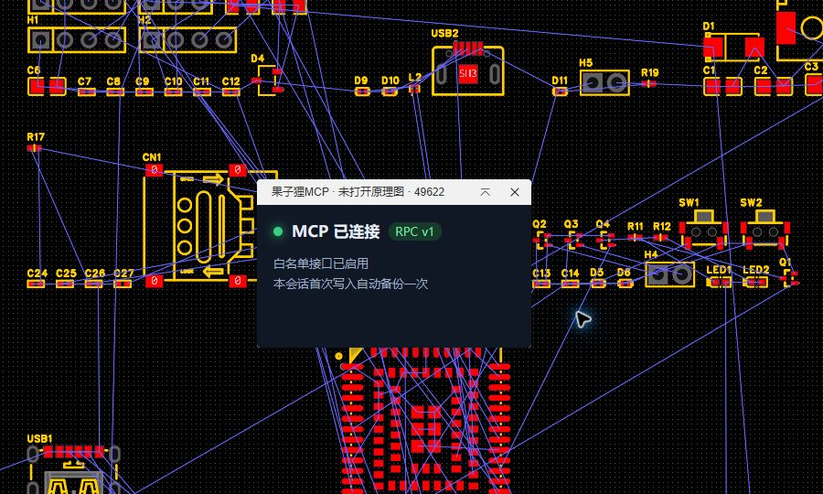
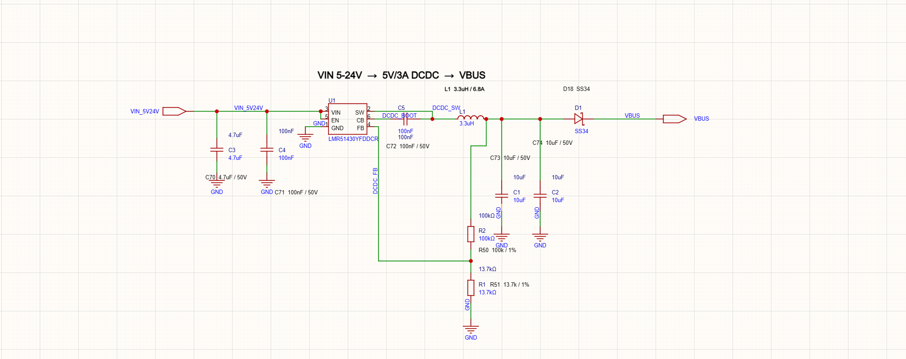
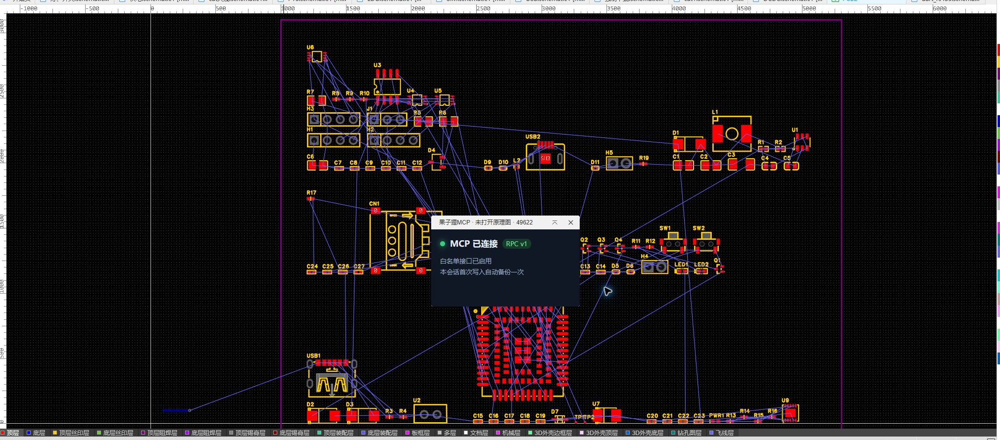
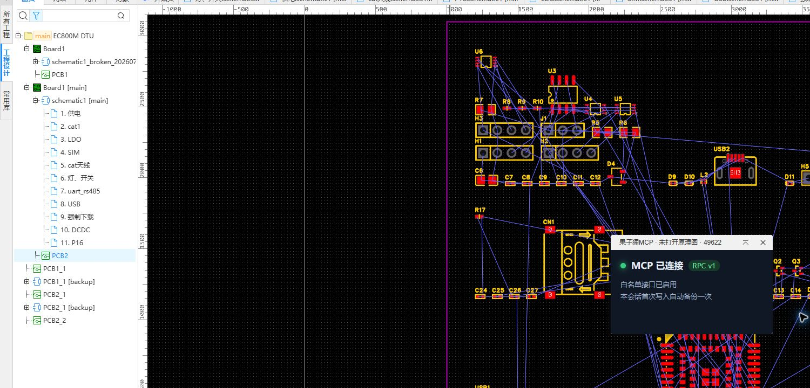

# 果子狸MCP服务

果子狸MCP服务是嘉立创 EDA / EasyEDA 专业版的本地 MCP 连接扩展。它与用户电脑上运行的 MCP 服务配合，让 AI 客户端能够通过结构化工具读取和编辑当前原理图与 PCB。

## 功能演示

以下截图均来自果子狸 MCP 服务在嘉立创 EDA 专业版中的真实运行画面。

### 1. 确认扩展已经连接

启动 AI 客户端中配置的本地 MCP 服务，刷新嘉立创 EDA，然后打开“果子狸MCP服务 → 显示状态悬浮框”。看到“**MCP 已连接**”和“**白名单接口已启用**”后，就可以开始调用工具。



### 2. 读取、检查和编辑原理图

不需要预先逐页打开原理图，AI 可以列出整个工程的原理图和图页，并按整页或指定区域读取器件、引脚、网络、网络标签和导线。还可以检查器件清单、空闲放置区域、图面可读性及原理图 DRC。

写入能力包括放置、移动、旋转、镜像和删除器件，随器件成组移动完整导线，创建导线、网络端口、网络标识、文本和非连接标记，修改器件原生属性与 `Value`，以及重命名原理图或图页。所有操作均通过固定白名单接口执行。

```text
列出当前工程的所有原理图和图页，并检查电源页。
检查这张图的断线、零长度导线、交叉过多和器件间距。
把 U1 周围的外围器件整理整齐，保留完整的连接导线。
给指定引脚创建网络端口，并对未使用引脚设置原生非连接标记。
运行原理图 DRC，只汇报问题，先不要修改。
```



### 3. 检查、布局和编辑 PCB

AI 可以读取 PCB 的板框、叠层、封装、焊盘、网络、走线、过孔、铺铜和设计规则，也可以进行整板或局部检查。检查项目包括板框闭合性、未布线网络、保守识别的游离走线、器件重叠、板外器件、原理图与 PCB 一致性以及原生 PCB DRC。

确认方案后，可以创建 PCB，按原理图页归类器件，移动/旋转/锁定器件，对齐、等间距和栅格化布局；还可以创建、删除或整体替换板框，创建及原地修改走线、过孔和独立焊盘，按网络批量设置线宽/层/锁定策略，创建或重建铺铜，以及配置铜层数、内层名称和物理叠层。

```text
读取当前 PCB 的全部器件、板框、网络和设计规则。
按照原理图页给器件归类，只预览，不要立即移动。
检查板框是否闭合，并列出重叠和位于板框外的器件。
根据器件整体尺寸生成新的圆角板框，确认后再替换旧板框。
预览把 VCC 和 GND 的全部走线改为 20mil 会影响哪些图元。
运行 PCB DRC，并重建铺铜后再次检查。
```

读取、分析和预览不会改动板子；写入前会校验明确的图元 ID、坐标、层、网络和尺寸，避免把端点重叠误判成已连接。游离走线检测采用保守策略，不会因为线段短就直接删除。



### 4. 同步原理图变更

AI 可以先比较原理图与 PCB 的位号、封装、BOM 型号和网络差异，再发起同步。新建 PCB 时也可以建立原理图关联并配置叠层。**从原理图导入 PCB 的变更必须在嘉立创 EDA 中手动确认**，扩展不会绕过编辑器的确认界面。

```text
先检查原理图与 PCB 是否一致，只列出差异。
确认差异后，把原理图变更同步到关联的主 PCB。
```

### 5. 自动备份与恢复

每次 MCP 会话第一次写入原理图或 PCB 前，扩展会自动复制一份带 `[backup]` 标记的备份；同一会话的后续写入复用该备份。若结果不符合预期，可在工程树中打开对应备份恢复。



## 功能

### 原理图

- 工程级原理图/图页目录、整页或局部区域检查，以及器件清单分组。
- 器件、引脚、电气类型、坐标、旋转、镜像、真实边界、原生属性、网络标签、网络和导线读取。
- 页面占用网格、空闲矩形搜索、可读性分析和原生 DRC。
- 器件库搜索；器件放置、移动、旋转、镜像、删除及连线成组移动。
- 导线、网络端口、网络标识、文本、器件属性和非连接标记的创建或修改。
- 原理图、图页重命名，图页和指定图元删除。

### PCB

- 创建关联 PCB，读取 PCB 目录、整板快照和指定矩形区域。
- 板框、叠层、封装、焊盘、网络、走线、过孔、铺铜、区域和设计规则读取。
- 板框搜索及闭合检查、未布线网络、保守游离走线检测、重叠/板外器件检查、原理图一致性检查和原生 DRC。
- 按原理图页分组布局，以及器件移动、旋转、锁定、对齐、等间距和栅格化。
- 矩形、多边形、开放补线及圆角板框创建；指定删除和整体替换板框。
- 走线、过孔、独立焊盘和铺铜创建；走线/过孔保留原图元 ID 的原地修改。
- 按网络名称批量预览或应用线宽、铜层和锁定策略。
- 铜层数、内层名称和物理叠层配置，以及铺铜重建。
- 原理图/PCB 差异检查和经人工确认的变更同步。

### 连接与安全

- 仅连接本机 `127.0.0.1`，使用令牌握手及固定 RPC 白名单，不提供任意 JavaScript 执行能力。
- 所有写入先预检并串行执行；组合操作失败时执行对应补偿。
- 每次会话首次写入自动建立原理图或 PCB 备份，并拒绝把备份 PCB 当作主板继续修改。
- 状态悬浮框、自动或固定端口配置，以及可持久化 Debug 日志。

## 使用方法

1. 导入并启用本扩展。
2. 在电脑上安装 Node.js 20 或更高版本。
3. 从 `https://github.com/lyq11/guozili-mcp-service` 下载源码并运行 `npm install`。
4. 将仓库中的 `src/server.mjs` 配置为 AI 客户端的 stdio MCP 服务。
5. 刷新一次嘉立创 EDA 页面并打开原理图。
6. 通过“果子狸MCP服务”菜单打开状态悬浮框；显示“已连接”后即可调用 MCP 工具。

默认自动扫描端口 `49620-49629`。如需让不同 MCP 客户端使用互不冲突的端口，可打开“果子狸MCP服务 → 设置 MCP 端口”，输入 `1-65535` 之间的固定端口；输入 `0` 恢复自动扫描。修改后扩展会立即重连，设置在 EasyEDA 重启后仍然有效。

固定端口时，本地 MCP 服务必须使用相同端口。例如固定为 `49625`，应同时为 MCP 进程设置 `EASYEDA_MCP_PORT_START=49625` 和 `EASYEDA_MCP_PORT_END=49625`。

如果连接未建立，请确认 MCP 客户端已经启动服务、两端端口一致且未被防火墙阻止，并点击“重新连接”。扩展只连接 `127.0.0.1`，不会访问局域网或公网服务。

需要排查问题时，选择“果子狸MCP服务 → 开启/关闭 Debug 日志”。开启后扩展会重连，并在 EasyEDA 开发者控制台输出带 `[果子狸MCP:debug]` 前缀的日志；MCP 进程同时在 stderr 输出带 `[easyeda-mcp:rpc]` 前缀的调用、返回、耗时和异常日志。Debug 开关会在重启后保留，令牌会脱敏，超大载荷会截断。

## 安全说明

本扩展不提供任意 JavaScript 执行能力。所有请求都必须通过令牌握手和固定 RPC 能力白名单。写操作会在 MCP 侧串行发送；一组编辑器 API 操作并非原子事务，操作失败时可以使用首次写入前生成的原理图备份恢复。

## 源码与问题反馈

- 源码：`https://github.com/lyq11/guozili-mcp-service`
- 问题反馈：`https://github.com/lyq11/guozili-mcp-service/issues`

许可证：Apache-2.0。
